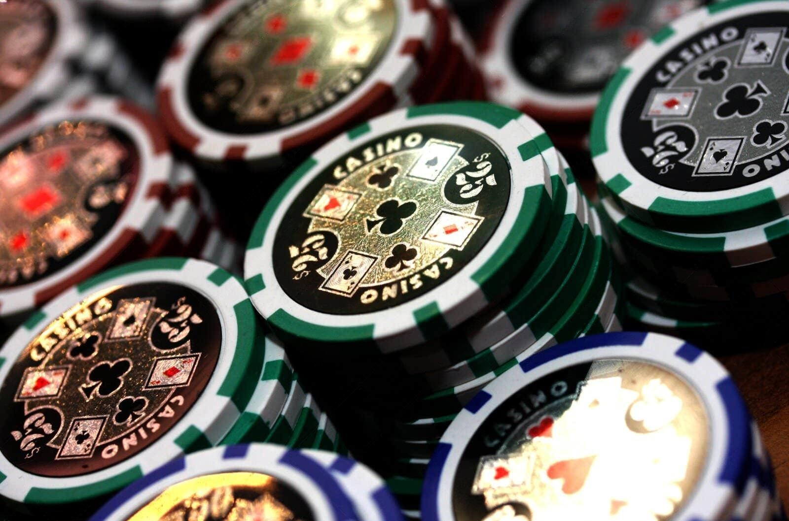
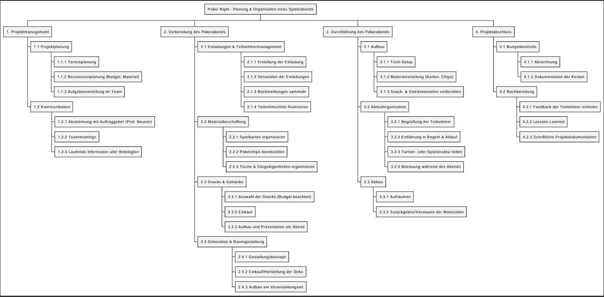
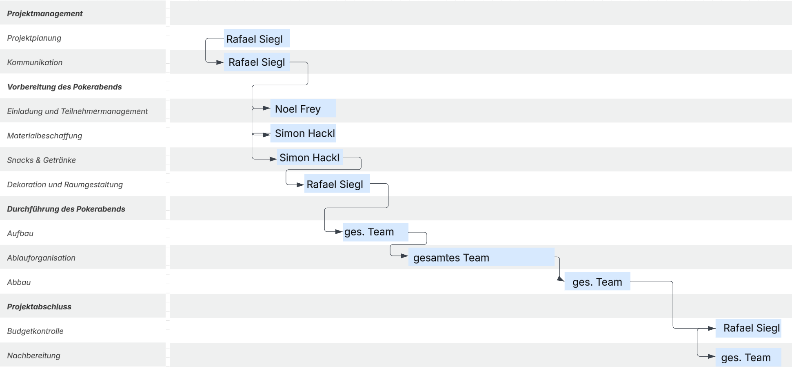
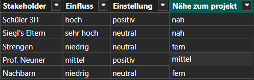
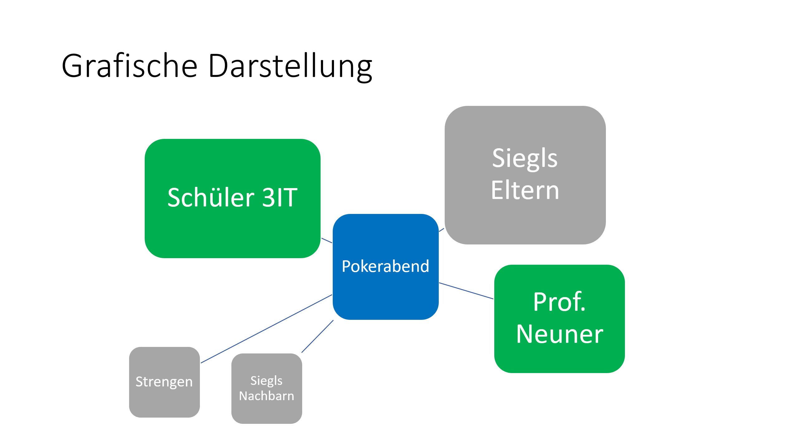
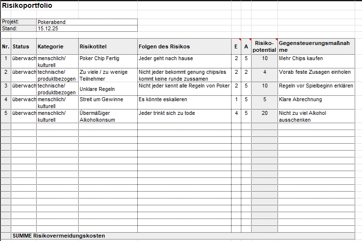

# 🎲 **Projektarbeit: Planung und Durchführung eines Pokerabends**  

**Projektname:**  
**💥 „Poker Night – Planung & Organisation eines Spieleabends“ 💥**

**Projektteam:**  
- **Projektleiter:** Rafael Crispin Siegl  
- **Projektmitarbeiter:** Noel Frey  
- **Projektmitarbeiter:** Simon Hackl  

**Projektauftraggeber:**  
Herr Prof. Neuner  

**Kunde:**  
Teilnehmerinnen und Teilnehmer des Pokerabends  

**Abgabe:**  
15. Dezember  

# 📑 **Inhaltsverzeichnis**

1. Projektbeschreibung  
2. Zielsetzung  
3. Projektorganisation  
4. Organisationsform: Matrix-Organisation
5. Projektstruktur-Plan
6. Gannt - Chart 
7. Projektumfeldanalyse
8. Risikoanalyse
9. User Storys

# 📘 **Projektbeschreibung**

Unser Projekt beschäftigt sich mit der vollständigen Planung und Umsetzung eines Pokerabends. Dabei sollen alle notwendigen organisatorischen Schritte – von der Einladung über die Vorbereitung der Spielmaterialien bis hin zur Verpflegung – sorgfältig durchdacht und umgesetzt werden.  
Ziel ist es, einen **gemütlichen, unterhaltsamen und strukturierten Abend** zu gestalten, an dem alle Teilnehmenden Spaß haben und ein reibungsloser Ablauf gewährleistet ist.

---

# 🎯 **Zielsetzung**

Wir wollen bis spätestens **15. Dezember** einen **Pokerabend für mindestens zehn Personen** veranstalten.  
Das Gesamtbudget beträgt **maximal 100 €**.

Es soll sichergestellt werden, dass:

- ausreichend **Spielkarten**, **Pokerchips** und **Tische** vorhanden sind  
- genügend **Snacks und Getränke** zur Verfügung stehen  
- alle Teilnehmer **rechtzeitig informiert** werden  
- der Ablauf klar geplant ist  
- Aufgaben sinnvoll verteilt werden, um einen **entspannten und erfolgreichen Abend** zu ermöglichen

---

# 🧩 **Projektorganisation**

### 👤 **Projektauftraggeber**  
- Herr Professor Neuner

### 🧭 **Projektleiter**  
- **Rafael Crispin Siegl**  
  Verantwortlich für Planung, Terminkoordination und den Überblick über alle Arbeitsbereiche.

### 🛠️ **Projektmitarbeiter**  
- **Noel Frey** → Organisation & Kommunikation  
- **Simon Hackl** → Snacks & Dekoration

### 🎉 **Kunde**  
- Teilnehmerinnen und Teilnehmer des Pokerabends

---

# 🗂️ **Organisationsform: Matrix-Organisation**

Wir haben uns für eine **Matrix-Organisation** entschieden.  
Das bedeutet:

- Zusammenarbeit erfolgt **eng und flexibel**  
- Aufgaben werden nach **Zeitkapazität und Fähigkeiten** verteilt  
- Der Projektleiter behält die Übersicht  
- Teammitglieder unterstützen sich **gegenseitig**, was uns ermöglicht, schnell auf Änderungen zu reagieren  
- Die matrixartige Struktur hilft uns, das Projekt effizient und zielgerichtet zum Erfolg zu führen

# 🧱 **Projektstrukturplan (PSP)**

Hier wird der Projektstrukturplan dargestellt. Er gliedert das Projekt in übersichtliche Arbeitspakete und Teilbereiche.

# 🗓️ **Gantt-Chart**

Das folgende Gantt-Chart zeigt die zeitliche Planung des Projekts.

# 🔍 **Projektumfeldanalyse**

# ⚠️ **Risikoanalyse**

#  **User Stories**

## 1. Pokerabend organisieren (Gastgeber)

**Als Gastgeber**  
möchte ich einen festen Termin und Ort für den Pokerabend festlegen,  
**damit** alle Freunde rechtzeitig planen können.

### Akzeptanzkriterien
- Termin und Ort sind mindestens **eine Woche im Voraus** festgelegt.
- Alle eingeladenen Freunde wurden über **Datum, Uhrzeit und Adresse** informiert.
- Mindestens **75 % der Eingeladenen** haben ihre Teilnahme bestätigt.

---

## 2. Spielregeln festlegen (Mitspieler)

**Als Mitspieler**  
möchte ich die Spielregeln vorab kennen,  
**damit** es während des Pokerabends keine Missverständnisse gibt.

### Akzeptanzkriterien
- Die Spielvariante (z. B. Texas Hold’em) ist klar definiert.
- Einsatzhöhe und Buy-in sind vorab kommuniziert.
- Die Blind-Struktur ist festgelegt und verständlich dokumentiert.
- Alle Teilnehmer bestätigen, dass sie die Regeln verstanden haben.

---

## 3. Snacks & Getränke organisieren (Teilnehmer)

**Als Teilnehmer**  
möchte ich Snacks und Getränke gemeinsam abstimmen oder aufteilen,  
**damit** sich alle wohlfühlen und niemand alles allein organisieren muss.

### Akzeptanzkriterien
- Es existiert eine Liste mit Snacks und Getränken.
- Jeder Teilnehmer übernimmt mindestens **einen Beitrag**.
- Besondere Vorlieben oder Unverträglichkeiten sind berücksichtigt.
- Zum Start des Pokerabends sind alle zugesagten Snacks und Getränke vorhanden.